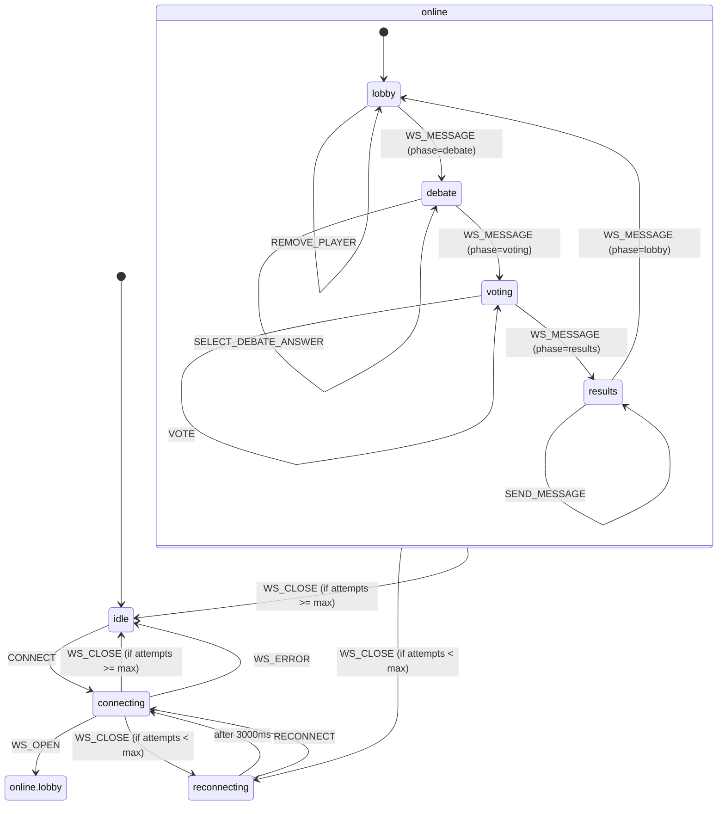
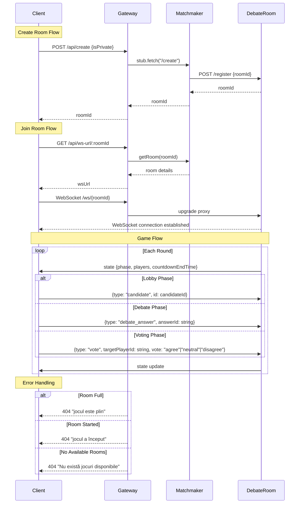

# Jocul Democrației - Documentație Tehnică

## Despre proiect

"Jocul Democrației" este un joc multiplayer educativ care simulează o dezbatere politică în timp real. Jucătorii adoptă roluri de candidați politici, aleg mesaje aliniate cu ideologia personajului lor, votează argumentele cele mai coerente și primesc puncte în funcție de performanța lor.

Scopul jocului este de a educa despre procesul democratic, de a încuraja gândirea critică în contextul politic intr-un mod distractiv.

### Cum funcționează

1. **Lobby**: Jucătorii se alătură unei camere de joc și își aleg un candidat politic
2. **Dezbatere**: Fiecare jucător primește un set de mesaje aliniate cu ideologia candidatului ales și selectează unul
3. **Votare**: Jucătorii votează mesajele celorlalți (de acord/neutru/nu sunt de acord)
4. **Rezultate**: Se calculează scorurile și se afișează clasamentul
5. **Runde multiple**: Jocul continuă pentru 3 runde cu teme diferite

## Cum au fost culese datele pentru mesajele candidatilor

A fost folosit modelul o3 cu Deep Research de la ChatGPT pentru a gasit mesajele candidatilor.
Am folosit urmatorul template:

```
Candidat la alegerile prezidenţiale: Nicusor Dan
Topic: Diplomatie  
Întrebare-cheie: „Cum veți consolida relațiile cu vecinii României într-un context regional tensionat?”

Găsește exact 10 declarații publice (2022-2025) care răspund la întrebare.
Pentru fiecare:
• 15-25 cuvinte, rezumat fidel sau citat scurt  
• isRisky = true dacă include controlul prețurilor / naționalizări / plafonări; altfel false  
• Sursa: link + dată

- doar in limba romana, 
- pot fi extrase din orice sursa reputabila
- si opinii indirecte
- pot fi parafrazari directe care au legatura cu tema si sunt apropiate foarte mult de intrebare

Returnează ca JSON array, cu obiecte cu proprietatile {id, isRisky, source, date, quote}
- la sursa pune link-ul URL gasit
- data formatata DD.LL.YYYY
- id de forma "1", "2", "3" ... formatat ca string
```

Apoi am iterat pentru fiecare canditat si topic.
Toate declarațiile au fost puse in [shared/utils/src/research-data/candidate-responses/](./shared/utils/src/research-data/candidate-responses)


## Instalare și rulare locală

### Cerințe preliminare

- Node.js 18+
- pnpm (manager de pachete)
- Cont Cloudflare (pentru dezvoltare completă)

### Configurare inițială

1. Clonează repository-ul:
```bash
git clone https://github.com/ciocan/joculdemocratiei.ro.git
cd joculdemocratiei.ro
```

2. Instalează dependențele:
```bash
pnpm install
```

3. Configurează variabilele de mediu:
   - Copiază fișierele `.env.example` în `.env` pentru fiecare serviciu
   - Completează variabilele necesare (JWT_SECRET, etc.)
   - În `services/app/.env`, setează `VITE_GAME_SERVER_URL` la `http://localhost:4201`
   - În `services/game-server/.dev.vars`, setează `JWT_SECRET` la `ceva-random`

### Rulare

Proiectul folosește Turborepo pentru a gestiona monorepo-ul. Pentru a rula toate serviciile simultan:

```bash
pnpm dev
```

Sau pentru a rula serviciile individual:

```bash
# Frontend (TanStack Start)
cd services/app
pnpm dev

# Game Server (Cloudflare Worker)
cd services/game-server
pnpm dev

# Game Backend (Cloudflare Worker)
cd services/game-backend
pnpm dev
```

Aplicația va fi disponibilă la:
- Frontend: http://localhost:4200
- Game Server API: http://localhost:4201

## Detalii tehnice

### Arhitectura proiectului

Proiectul este structurat ca un monorepo folosind pnpm workspaces, cu următoarele componente principale:

1. **Frontend (services/app)**
   - Framework: TanStack Start (React)
   - Routing: TanStack Router
   - State Management: XState (state machine) și Zustand (global state)
   - UI: Radix Theme + Tailwind CSS

2. **Game Server (services/game-server)**
   - Cloudflare Worker cu Durable Objects
   - Gestionează camerele de joc și conexiunile WebSocket
   - Implementează logica de joc

3. **Game Backend (services/game-backend)**
   - Cloudflare Worker cu D1 Database
   - Gestionează persistența datelor și autentificarea
   - Oferă API pentru statistici și istoric

4. **Shared Utils (shared/utils)**
   - Cod comun între servicii
   - Tipuri, constante și funcții utilitare
   - Algoritm de scoring

### Mecanismul jocului

#### State machine pentru joc

Jocul folosește XState v5 pentru a gestiona stările și tranzițiile. Principalele stări sunt:

1. **idle**: Starea inițială înainte de conectare
2. **lobby**: Jucătorii se alătură și își aleg candidații
3. **debate**: Jucătorii selectează mesaje pentru tema curentă
4. **voting**: Jucătorii votează mesajele celorlalți
5. **results**: Se afișează rezultatele rundei
6. **gameOver**: Jocul s-a încheiat (după 3 runde)

Diagrama state machine pentru joc:




#### Fluxul de joc pas cu pas

1. **Creare joc**:
   - Un jucător creează un joc nou sau se alătură unui joc existent
   - Matchmaker DO gestionează listarea și alocarea jocurilor

2. **Lobby**:
   - Jucătorii își aleg candidații politici
   - Când toți jucătorii sunt pregătiți, jocul avansează

3. **Dezbatere**:
   - Fiecare jucător primește o temă unica pe runda și un set de mesaje reale ale candidatului ales
   - Jucătorii selectează un mesaj care reprezintă poziția candidatului lor

4. **Votare**:
   - Jucătorii văd mesajele anonime ale celorlalți
   - Fiecare jucător votează (de acord/neutru/nu sunt de acord) pentru fiecare mesaj

5. **Rezultate**:
   - Se calculează scorurile folosind algoritmul Bridge-Empathy
   - Se afișează clasamentul și statisticile rundei
   - Se afiseaza mesajele alese cu sursele si linkurile la articolele de unde provin

6. **Runde multiple**:
   - Jocul continuă pentru 3 runde cu teme diferite
   - Scorurile cumulative sunt actualizate după fiecare rundă

Secvența de creare și alăturare la un joc:

### Algoritmul de scoring

Jocul folosește un sistem de scoring numit "Bridge-Empathy" care recompensează:

1. **Influența**: Puncte primite când alți jucători sunt de acord cu mesajul tău
   - Mai multe puncte pentru acorduri de la jucători cu ideologii diferite
   - Penalizări pentru dezacorduri

2. **Empatia**: Puncte primite pentru voturile date
   - Puncte pentru a fi de acord cu alții
   - Penalizări pentru dezacorduri
   - Bonusuri pentru a fi de acord cu jucători cu ideologii opuse

3. **Armonie**: Scorul final calculat ca `sqrt(influenta * empatie)`

Factori care influențează scorul:
- **Distanța ideologică**: Calculată în spațiul 3D al ideologiei (economie, social, guvernare)
- **Bonusuri strategice**: Pentru a fi cel mai votat, pentru a avea un raport ridicat de acorduri, etc.
- **Mesaje riscante**: Mesajele marcate ca "riscante" pot aduce bonusuri mai mari (in curand)

Exemplu de calcul:
```typescript
// Calculul distanței ideologice normalizate
function normalisedDistance(a: Candidate, b: Candidate): number {
  const dx = a.ideology.e - b.ideology.e;
  const dy = a.ideology.s - b.ideology.s;
  const dz = a.ideology.g - b.ideology.g;
  return Math.sqrt(dx * dx + dy * dy + dz * dz) / MAX_DIST;
}

// Determinarea categoriei de distanță
function distanceBucket(a: Candidate, b: Candidate): "close" | "neutral" | "opposite" {
  const d = normalisedDistance(a, b);
  if (d < 0.25) return "close";
  if (d < 0.55) return "neutral";
  return "opposite";
}
```

Ponderile pentru calculul scorului:

```typescript
// Bridge-point weights pentru un "agree" bazat pe distanța ideologică
const BP_WEIGHT = {
  close: 2,    // Pentru candidați apropiați ideologic
  neutral: 4,  // Pentru candidați cu ideologie neutră
  opposite: 8, // Pentru candidați cu ideologie opusă
};

// Penalizare pentru un "disagree"
const BP_DISAGREE = -2;

// Empathy points primite de votant când acordă un vot
const EP_WEIGHT: Record<VoteValue, number> = {
  agree: 2,    // Pentru vot de acord
  neutral: 0,  // Pentru vot neutru
  disagree: -2, // Pentru vot de dezacord
};

// Bonusuri pentru votare strategică
const STRATEGIC_BONUS = {
  // Bonus pentru a fi de acord cu cineva foarte diferit de tine
  crossIdeologyAgree: 3,
  // Bonus pentru a fi cel mai votat jucător într-o rundă
  mostAgreedWith: 5,
  // Bonus pentru a avea un raport ridicat de acorduri/dezacorduri (minim 3 voturi)
  highAgreeRatio: 4,
};
```

### Stocarea și Analiza Datelor

Sistemul folosește mai multe tehnologii pentru stocarea și analiza datelor:

1. **Cloudflare Analytics Engine** (ClickHouse):
   - Stochează datele clasamentului în timp real
   - Permite interogări complexe pentru analiza performanței jucătorilor
   - Structura datelor include:
     - Scoruri per rundă (influență, empatie, armonie)
     - Scoruri finale și clasament
     - Statistici despre voturi (acorduri, neutre, dezacorduri)
     - Informații despre jucători și candidați

   Datele sunt salvate în Analytics Engine în trei tipuri de evenimente:

   a) **Evenimente per rundă** (`round:${playerId}`):
   ```typescript
   {
     indexes: [`round:${playerId}`],
     doubles: [
       roundScores.influence,    // double1: Scor influență
       roundScores.empathy,      // double2: Scor empatie
       roundScores.harmony,      // double3: Scor armonie
       roundTotalScore,          // double4: Scor total
       agreeVotes,               // double5: Voturi de acord
       neutralVotes,             // double6: Voturi neutre
       disagreeVotes,            // double7: Voturi de dezacord
     ],
     blobs: [
       roomId,                   // blob1: ID joc (camera)
       playerId,                 // blob2: ID jucător
       playerName,               // blob3: Nume jucător
       answerId,                 // blob4: ID răspuns
       candidateId,              // blob5: ID candidat
       roundNumber,              // blob6: Număr rundă
       answer,                   // blob7: Răspuns
       topicId,                  // blob8: ID topic
       question,                 // blob9: Întrebare
       city,                     // blob10: Oraș
       county,                   // blob11: Județ
       countyCode                // blob12: Cod județ
     ]
   }
   ```

   b) **Evenimente cumulative** (`cumulative:${playerId}`):
   ```typescript
   {
     indexes: [`cumulative:${playerId}`],
     doubles: [
       cumulativeScores.influence, // double1: Scor influență cumulat
       cumulativeScores.empathy,   // double2: Scor empatie cumulat
       cumulativeScores.harmony,   // double3: Scor armonie cumulat
       cumulativeTotalScore,       // double4: Scor total cumulat
       agreeVotes,                 // double5: Voturi de acord
       neutralVotes,               // double6: Voturi neutre
       disagreeVotes               // double7: Voturi de dezacord
     ],
     blobs: [
       roomId,                     // blob1: ID joc (camera)
       playerId,                   // blob2: ID jucător
       playerName,                 // blob3: Nume jucător
       candidateId,                // blob4: ID candidat
       roundNumber,                // blob5: Număr rundă
       topicId,                    // blob6: ID topic
       question,                   // blob7: Întrebare
       city,                       // blob8: Oraș
       county,                     // blob9: Județ
       countyCode                  // blob10: Cod județ
     ]
   }
   ```

   c) **Evenimente finale** (`final:${playerId}`):
   ```typescript
   {
     indexes: [`final:${playerId}`],
     doubles: [
       finalInfluence,            // double1: Scor final influență
       finalEmpathy,              // double2: Scor final empatie
       finalHarmony,              // double3: Scor final armonie
       finalTotalScore,           // double4: Scor final total
       totalPlayers               // double5: Număr total jucători
     ],
     blobs: [
       roomId,                    // blob1: ID joc (camera)
       playerId,                  // blob2: ID jucător
       playerName,                // blob3: Nume jucător
       candidateId,               // blob4: ID candidat
       rank,                      // blob5: Poziție finală
       city,                      // blob6: Oraș
       county,                    // blob7: Județ
       countyCode                 // blob8: Cod județ
     ]
   }
   ```

   Datele sunt salvate automat la finalul fiecărei runde și la finalul jocului, oferind o imagine completă a performanței jucătorilor.

2. **D1 Database (SQLite)**:
   - Stochează date persistente despre:
     - Profiluri utilizatori
     - Istoricul jocurilor
     - Camere active
   - Folosește Drizzle ORM pentru gestionarea bazelor de date
   - Migrări automate pentru schema bazei de date

Structura clasamentului:
```typescript
type LeaderboardData = {
  roundScores: {
    influence: number;
    empathy: number;
    harmony: number;
    totalScore: number;
    agreeVotes: number;
    neutralVotes: number;
    disagreeVotes: number;
    roundNumber: number;
    debateTopic: string;
    debateQuestion: string;
    answer: string | null;
  }[];
  finalScores: {
    influence: number;
    empathy: number;
    harmony: number;
    totalScore: number;
    totalPlayers: number;
    rank: number;
  } | null;
};
```


Datele sunt procesate în timp real și stocate în:
- **Analytics Engine** pentru interogări rapide și analize
- **D1 Database** pentru persistență pe termen lung
- **R2 Bucket** pentru arhivare și backup

### Utilizarea datelor

Datele salvate în joc includ:

1. **Profiluri utilizatori**:
   - Informații de bază (nume, locație) sunt create aleatoriu. Se salveaza locatia (oras si judet) cu cele returnate de request-ul din Cloudflare. Altfel se foloseste locatia aleasa aleatoriu. Coordonatele gps sunt setate cu o margine de eroare de 1km patrat peste ce returneaza request-ul.
   - Numele si prenumele sunt create aleatoriu din lista de nume si prenume din Romania.

2. **Istoricul jocurilor**:
   - Rundele jucate
   - Mesajele selectate
   - Voturile acordate
   - Scorurile obținute

3. **Jocuri active**:
   - Lista jocurilor disponibile
   - Numărul de jucători în fiecare joc
   - Starea jocului

Datele sunt stocate în:
- **D1 Database** (sqlite): Pentru persistența pe termen lung
- **Durable Objects**: Pentru starea în timp real a jocului
- **R2 Bucket**: Pentru arhivarea jocurilor finalizate (in curand)

Mecanismul de curățare a datelor:
- Camerele inactive sunt curățate automat după terminare.
- Jocurile finalizate sunt arhivate în D1


## Tehnologii utilizate

### Frontend
- **React 19**: 
- **TanStack Start**: Framework full-stack
- **TanStack Router**: Rutare type-safe
- **TanStack Query**: Fetching și caching de date
- **XState v5**: Mașini de stare pentru logica de joc
- **Zustand**: State management global
- **Tailwind CSS**: Styling
- **Radix Theme**: Componente accesibile

### Backend
- **Cloudflare Workers**: Serverless compute
- **Durable Objects**: State persistent și sincronizat
- **D1 Database**: Bază de date SQL la edge (sqlite)
- **WebSockets**: Comunicare în timp real
- **JWT**: Autentificare și autorizare

### Dezvoltare
- **TypeScript**: Type safety
- **pnpm**: Manager de pachete
- **Turborepo**: Monorepo management
- **Biome**: Linting și formatting
- **Drizzle ORM**: ORM pentru D1
- **Zod**: Validare de scheme

## Contribuții și dezvoltare

### Structura repository-ului

```
joculdemocratiei.ro/
├── services/
│   ├── app/               # Frontend (TanStack Start)
│   ├── game-server/       # Game Server (Cloudflare Worker)
│   └── game-backend/      # Game Backend (Cloudflare Worker)
├── shared/
│   └── utils/             # Shared utilities
├── package.json           # Root package.json
└── turbo.json             # Turborepo configuration
```

### Comenzi utile

```bash
# Dezvoltare
pnpm dev                   # Rulează toate serviciile
pnpm build                 # Construiește toate serviciile
pnpm lint                  # Rulează linting pe toate serviciile
pnpm fmt                   # Formatează codul

# Deployment
pnpm deploy:dev            # Deployment în mediul de dezvoltare
pnpm deploy:prod           # Deployment în producție

# Database
cd services/game-backend
pnpm db:studio             # Interfață pentru baza de date
pnpm db:generate           # Generează migrări
pnpm db:migrate            # Rulează migrările
pnpm db:studio:local       # Interfață pentru baza de date în mediu de dezvoltare
```

## Securitate

Proiectul implementează mai multe măsuri de securitate pentru a proteja utilizatorii și infrastructura:

### Rate Limiting
- Rate limiting implementat la nivel de Cloudflare Worker pentru toate endpointurile API
- Limite configurate pe baza tipului de endpoint și a criticității operațiunii
- Rate limiting bazat pe IP și locatie

### Protecție împotriva boților
- Turnstile Cloudflare implementat pentru crearea de conturi
- Verificare automată a tokenurilor Turnstile înainte de procesarea cererilor

### Măsuri Adiționale
- Implementare de CORS strictă

## Licență

MIT
